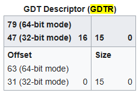

# Stage 4: Reload GDT and Reset Code Segment Register

## Set the stack pointer

### Purpose: 這段程式碼要完成什麼？
設定 stack pointer

### Problem: 為什麼需要這個操作？
後續指令需要使用 `lretq` 指令，重新載入 Code Segment。 

使用 `lretq` 指令，需要 stack 機制。所以需要設定 stack pointer。

### Implementation: 它實際怎麼完成？

[**SYM_CODE_START(startup_64) to SYM_CODE_END(startup_64)**](https://elixir.bootlin.com/linux/v6.14/source/arch/x86/boot/compressed/head_64.S#L341)
```x86asm=341
	/* Set up the stack */
	leaq	rva(boot_stack_end)(%rbx), %rsp
```

把 `rsp` 設為 `boot_stack_end` 的 記憶體位址 

## 64-bit GDT descriptor

[**SYM_DATA_START_LOCAL(gdt64) to SYM_DATA_END(gdt64)**](https://elixir.bootlin.com/linux/v6.14/source/arch/x86/boot/compressed/head_64.S#L600)

```x86asm
	.data
SYM_DATA_START_LOCAL(gdt64)
	.word	gdt_end - gdt - 1   /*  GDTR Limit */
	.quad   gdt - gdt64         /*  64-bit GDTR Base */  
SYM_DATA_END(gdt64)
```


## Reload the GDT

### Purpose: 這段程式碼要完成什麼？
將 GDT 位址重新載入 GDTR

### Context: CPU / kernel 現在處於什麼狀態？

進入 64-bit kernel Setup code 的方式
* 除了執行 32-bit kernel Setup code 的最後一條指令 `lret` ，接著跳轉到 64-bit kernel Setup code。
* 也可以是由 bootloader 自行將 CPU 切換到 64 bit long mode。並且將 CPU 控制權交給 kernel 從 64-bit kernel Setup code 開始執行。

若是採用第二種方式進入 long mode，那 kernel 仍使用在 bootloader 定義的 GDT。 

### Problem: 為什麼需要這個操作？

kernel 必須使用自己定義的 GDT。而非依賴於 bootloader 定義的 GDT。

### Implementation: 它實際怎麼完成？

[**SYM_CODE_START(startup_64) to SYM_CODE_END(startup_64)**](https://elixir.bootlin.com/linux/v6.14/source/arch/x86/boot/compressed/head_64.S#L365)

```x86asm=365
	/* Make sure we have GDT with 32-bit code segment */
	leaq	gdt64(%rip), %rax
	addq	%rax, 2(%rax)
	lgdt	(%rax)
```



* `leal	gdt64(%rip), %rax`: 取得 Symbol `gdt64` 的 runtime address。
* `add %rax, 2(%rax)`: 
    * 這個指令將 **`%rax` 的值**加到 **`%rax + 2` 的記憶體位址**所儲存的值。
    * 執行指令前，`%rax + 2` 的記憶體位址儲存 Symbol `gdt64` 到 Symbol `gdt` 的偏移量。
    * 執行指令後, `%rax + 2` 的記憶體位址，也就是 GDT Descriptor 的 base address 欄位。此欄位設為 Symbol `gdt` 的 runtime address。
* `lgdt (%rax)`: 這個指令載入 GDT Descriptor，更新 GDTR，使 GDTR 指向新的 GDT。

### Result: 完成後 CPU / kernel 處於什麼狀態？

kernel 已使用自己定義的 GDT。

## Reload the Code Segment from current GDT

### Purpose: 這段程式碼要完成什麼？

重新載入 Code Segment

### Context: CPU / kernel 現在處於什麼狀態？

進入 64-bit kernel Setup code 的方式
* 除了執行 32-bit kernel Setup code 的最後一條指令 `lret` ，接著跳轉到 64-bit kernel Setup code。
* 也可以是由 bootloader 自行將 CPU 切換到 64 bit long mode。並且將 CPU 控制權交給 kernel 從 64-bit kernel Setup code 開始執行。

若是採用第二種方式進入 long mode，
Code Segment register 仍舊是載入 bootloader 定義的 Code Segment Selector。 

### Problem: 為什麼需要這個操作？

Code Segment Register 不能像其他 Segment Register 一樣。
直接使用 `movq` 修改 Code Segment Register 的值。
需要使用 `lretq` 機制重新載入 Code Segment Register。

### Mechanism: 這段程式碼使用什麼機制?

`lretq` 會 pop 出 stack 頂端的兩個值
第一個值由 `%rip` 接住
第二個值由 `%cs` 接住
透過這個機制修改 Code Segment Register

```
Stack
     +------------------+  
     |  Value for rip   | top
     |  Value for cs    |
     |                  |
     +------------------+  
```

### Implementation: 它實際怎麼完成？

[**SYM_CODE_START(startup_64) to SYM_CODE_END(startup_64)**](https://elixir.bootlin.com/linux/v6.14/source/arch/x86/boot/compressed/head_64.S#L370)
```x86asm=370
	/* Reload CS so IRET returns to a CS actually in the GDT */
	pushq	$__KERNEL_CS
	leaq	.Lon_kernel_cs(%rip), %rax
	pushq	%rax
	lretq
    
.Lon_kernel_cs:
```

### Result: 完成後 CPU / kernel 處於什麼狀態？

Code Segment Register 已載入 `$__KERNEL_CS` Code Segment Selector

## 參考來源

* [Linux-insides Booting Chapter 第 5 篇 Kernel decompression 第 1-4 段 Reload of the Global Descriptor Table](https://0xax.gitbook.io/linux-insides/summary/booting/linux-bootstrap-5#reload-of-the-global-descriptor-table)