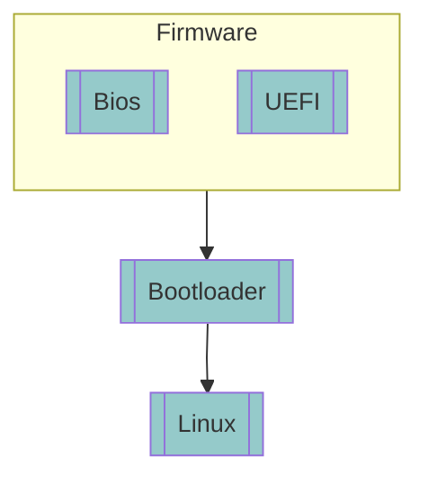
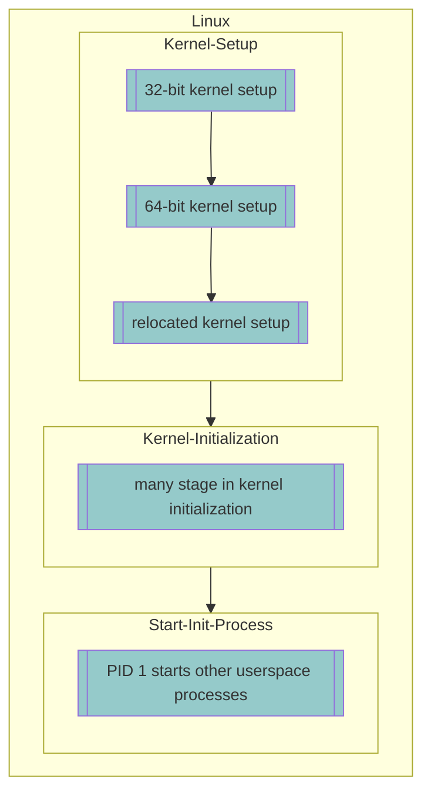
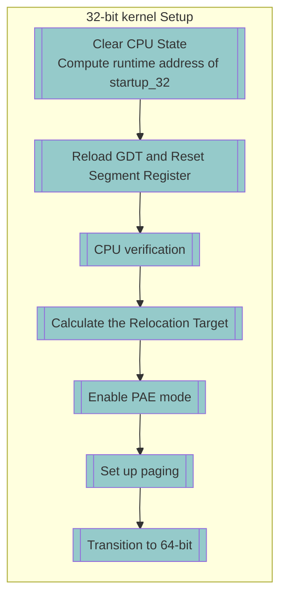
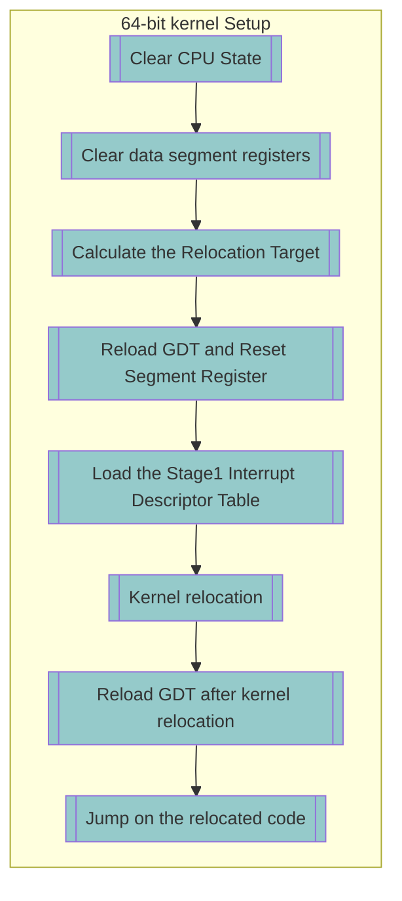
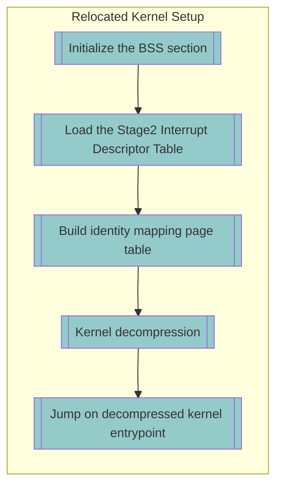

# x86-64-linux-bootup
本筆記逐步展開開機流程。先將開機流程分成 firmware、bootloader、linux 三個階段。 再將 Linux 開機流程展開成 Kernel Setup、Kernel Initialization 與 Start init process 三個階段。

本筆記主要探討 Kernel Setup 階段，以 kernel source code 為主要依據，逐步追蹤各階段的程式碼與 CPU / kernel 狀態變化。

後續將繼續追蹤 Kernel Initialization，以及 Start init process。

## Boot process
系統開機過程
- Firmware → Bootloader → Linux 

## Linux boot process
Linux 開機過程可以向下細分為 
- Kernel Setup → Kernel Initialization -> Start PID-1 process

完成開機後，Linux 進入可供使用者或應用程式使用的正常運行狀態。

### Kernel Setup

Kernel Setup 目的
- 準備 Kernel decompression 所需的執行環境
- 將 compressed kernel image 解壓縮至記憶體

Kernel Setup 完成事項
- 將 CPU 從 protected mode 切換到 long mode
- 將 compressed kernel image 搬移至 relocation target
- 解壓縮 compressed kernel image 

Kernel Setup 程式碼階段
- 32-bit Kernel Setup → 
- 64-bit Kernel Setup → 
- Relocated Kernel Setup → 

### Kernel Initialization

Kernel Initialization 目的
- 準備 userspace 程式可以在 kernel 正常運行所需的執行環境

Kernel Initialization 完成事項
- 初始化 core subsystem
- 設定 memory management
- 偵測 hardware
- 載入 driver

### Start init process

Start init process 目的
- 啟動 Linux userspace 的第一個 process, PID-1。
- 將後續 userspace process 所需的初始化工作交給 PID-1

Start init process 完成事項
- PID-1 執行系統的 init process，例如 `systemd`
- 由 PID-1 啟動其他必要的 userspace processes
    - 系統日誌, `systemd-journald`
    - 網路管理, `NetworkManager` 

## Scope

本筆記以 x86_64 Linux 搭配 GRUB2 作為 bootloader 的開機流程為主要範例。

GRUB2 負責載入 Compressed Kernel Image，並完成 32-bit Linux boot protocol 所要求的前置準備。GRUB2 完成準備後, 將 CPU 控制權交給 Kernel Setup Code。

本筆記的內容聚焦在**開機流程**的 **Kernel Setup 階段**。

完成 Kernel Setup 階段後，Kernel Setup Code 已將 Compressed Kernel Image 解壓縮到記憶體。並將 CPU 控制權交給 Decompressed Kernel。

## Reading list

本筆記的內容主要參考 Linux-insides。

GRUB2 完成的前置準備恰好對應 Linux-insides Booting Chapter 第 4 篇的起始狀態。

以下為閱讀清單:
* [Linux-insides Booting Chapter 第 4 篇 Transition to 64-bit mode](https://0xax.gitbook.io/linux-insides/summary/booting/linux-bootstrap-4)
* [Linux-insides Booting Chapter 第 5 篇 Kernel decompression](https://0xax.gitbook.io/linux-insides/summary/booting/linux-bootstrap-5)

## Prior Knowledge for 32-bit Kernel Setup
- [Real mode on x86-compatible processors](http://100.71.125.87:3000/2_whCScQQbmJoxQS4mWefQ)
- [Protected mode on x86-compatible processors](http://100.71.125.87:3000/NP0YD3GRTxSlQtAXr__Wrw)
- [Linker Script](http://100.71.125.87:3000/sSqTuTc9QVGpb8B1vJ2uhA)
- [x86 Paging](http://100.71.125.87:3000/f1Bjy9lkSB2KRSUQqLapSg)

## 32-bit Kernel Setup

內容來源:
[Linux-insides Booting Chapter 第 4 篇 Transition to 64-bit mode](https://0xax.gitbook.io/linux-insides/summary/booting/linux-bootstrap-4)

32-bit Kernel Setup 目的
- 準備進入 long mode 的執行環境
- 將 kernel 從 protected mode 切換到 long mode

32-bit Kernel Setup 完成事項
- 載入 kernel 自己定義的 GDT
- 確定 CPU 支援 long mode
- 計算出 compressed kernel image 的 relocation target。不過 64-bit Kernel Setup 會再重算一次。
- CPU 啟用 PAE mode in CR4
- 建立 boot page table，CR3 指向 boot page table 起始位址。
- CPU 啟用 Long Mode Enable in EFER
- CPU 啟用 Paging in CR0
- 跳轉至 64-bit kernel Setup 

32-bit Kernel Setup 程式碼階段
- [Stage 1: Clear CPU State and Compute runtime address of `startup_32`](http://100.71.125.87:3000/0IV0x1inQrma2dF4eWxGdg)
- [Stage 2: Reload GDT and Reset Segment Register](http://100.71.125.87:3000/aGOhZr-ORRKPJ0PBz4Dj2g)
- [Stage 3: CPU verification](http://100.71.125.87:3000/yWthmn6xRrGh8k4BfSEgVg)
- [Stage 4: Calculate the Relocation Target](http://100.71.125.87:3000/mqqwt-rKR6Cs9ZY38ppDHA)
- [Stage 5: Enable PAE mode](http://100.71.125.87:3000/bbYhVW1lQg6NB2pMuaG3Zw)
- [Stage 6: Set up paging](http://100.71.125.87:3000/MgSP3yOiRBKClEdgiFMgdA)
- [Stage 7: Transition to 64-bit](http://100.71.125.87:3000/hhiXLmwaTamhyIbb0HTrVw)

32-bit Kernel Setup 程式碼範圍
* [**SYM_FUNC_START(startup_32) to SYM_FUNC_END(startup_32)**](https://elixir.bootlin.com/linux/v6.14/source/arch/x86/boot/compressed/head_64.S#L82)

## Prior Knowledge for 64-bit Kernel Setup
[Calling Convention](http://100.71.125.87:3000/qh-tq5p-T9ekk1PX877ErA)

## 64-bit Kernel Setup
內容來源:
* [Linux-insides Booting Chapter 第 5 篇 Kernel decompression 第 1 段 First steps in the long mode](https://0xax.gitbook.io/linux-insides/summary/booting/linux-bootstrap-5#first-steps-in-the-long-mode)

64-bit Kernel Setup 目的
- 準備 kernel relocation 的執行環境
- 將 compressed kernel image 搬移至 relocation target

64-bit Kernel Setup 完成事項
- 計算出 compressed kernel image 的 relocation target。
- 載入 kernel 自己定義的 GDT
- 載入 kernel 自己定義的 IDT
- 將 compressed kernel image 搬移至 relocation target
- 跳轉至 relocated kernel Setup 

64-bit Kernel Setup 程式碼階段
- [Stage 1: Clear CPU State](http://100.71.125.87:3000/o3FUQwFkTQmcEOtTzlwRng)
- [Stage 2: Clear data segment registers](http://100.71.125.87:3000/QU0Rz-egQCSaf9HcWxIw5w)
- [Stage 3: Calculate the Relocation Target](http://100.71.125.87:3000/w_Dz7dVVQzW3oQPR90Mi9A)
- [Stage 4: Reload GDT and Reset Segment Register](http://100.71.125.87:3000/wtEPVFvsSGG01VqVteCSiw)
- [Stage 5: Load the Stage1 Interrupt Descriptor Table](http://100.71.125.87:3000/cboi0L5OT3e4_TGRy6JL1A)
- [Stage 6: Kernel relocation](http://100.71.125.87:3000/X56FuXzOTT-pjSIO-MGxig)
- [Stage 7: Reload GDT after kernel relocation](http://100.71.125.87:3000/JLXxUE7gSEeS5WbTE_cjcA)
- [Stage 8: Jump on the relocated code](http://100.71.125.87:3000/SY4l6CHqQp6l-8HRQvedFw)	

64-bit Kernel Setup 程式碼範圍
* [**SYM_CODE_START(startup_64) to SYM_CODE_END(startup_64)**](https://elixir.bootlin.com/linux/v6.14/source/arch/x86/boot/compressed/head_64.S#L286)

## Prior Knowledge for Relocated Kernel Setup
* [BSS Section](http://100.71.125.87:3000/oXgeUQp7Rq-sGKL5zUjwiA)
* [Page Fault Interrupt Handler](http://100.71.125.87:3000/rPnM4yf1QqC9LfEwpW0gew)
* [Linux Kernel Page-table Abstraction](http://100.71.125.87:3000/U6_Lta8VTUi_rNojyYTJrw)
* [ELF, Executable and Linking Format](http://100.71.125.87:3000/3jR2QuE0RBa4GxbxMkxh2A)

## Relocated Kernel Setup
內容來源:
* [Linux-insides Booting Chapter 第 5 篇 Kernel decompression 第 2、3 段](https://0xax.gitbook.io/linux-insides/summary/booting/linux-bootstrap-5#the-last-actions-before-the-kernel-decompression)

Relocated Kernel Setup 目的
- 準備 kernel decompression 的環境
- 將 compressed kernel image 解壓縮至 memory

Relocated Kernel Setup 完成事項
- 初始化 BSS section
- 載入 kernel 自己定義的 IDT，此時 IDT 已設定 PF 和 NMI entry
- 建立或擴充 identity mapping page table
- 將 compressed kernel image 解壓縮，得到 ELF executable file `vmlinux`。
- 將 ELF 的 `PT_LOAD` segments **載入** physical memory。
- 修改已載入的 kernel image 裡**需要修正的 address**
- CPU 跳轉至 decompressed kernel entry point

Relocated Kernel Setup 程式碼階段
- [Stage 1: Initialize the BSS section](http://100.71.125.87:3000/38RiVjc2SvW4U9CAhrcMYQ)
- [Stage 2: Load the Stage2 Interrupt Descriptor Table](http://100.71.125.87:3000/xDCc-Uk8SV6xnikAk6p6Ag)
- [Stage 3: Build identity mapping page table](http://100.71.125.87:3000/ROYLXHsDTdqdhXnTD08WpA)
- [Stage 4: Kernel decompression](http://100.71.125.87:3000/9UsgMwClQWq1Vstb9UAEjw)
- [Stage 5: Jump on decompressed kernel entrypoint](http://100.71.125.87:3000/i1x69KWHSBCRnmYX5Imgig)

Relocated Kernel Setup 程式碼範圍
* [SYM_FUNC_START_LOCAL_NOALIGN(.Lrelocated) to SYM_FUNC_END(.Lrelocated)](https://elixir.bootlin.com/linux/v6.14/source/arch/x86/boot/compressed/head_64.S#L453)

