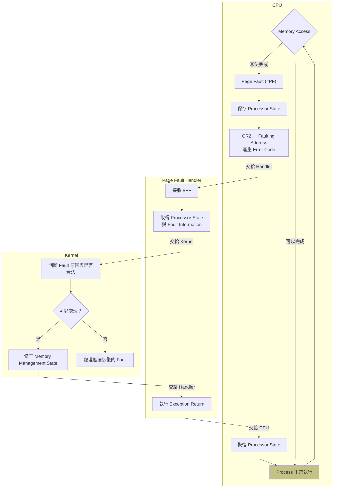

# Page Fault Interrupt Handler

Page Fault Interrupt handler 是 CPU 發生 `#PF` 後執行的 exception handling code。

## Purpose

* 處理 CPU 在執行 memory access 時產生的 Page Fault exception。

## Page Fault exception

CPU 執行 memory access 時，virtual address 必須經過 page table translation，且該 access 必須符合 page table entry 所設定的權限。

如果 page 不存在於記憶體，或 memory access 不符合 page table entry 所設定的權限。

CPU 皆無法完成這次 memory access，會產生 Page Fault exception（`#PF`）。

例如:
* Page table entry 的 Present bit 為 0，代表 page 尚未映射。
* 對 read-only page 執行 write。
* User mode 存取只允許 kernel mode 存取的 page。
* 執行被標記為不可執行的 memory。

## Page Fault 處理流程

x86 CPU 將 Page Fault 定義為 exception vector 14（`#PF`）。

Page Fault 的處理可以分成 CPU → Page Fault Interrupt Handler → Kernel 三個階段。

### 流程圖

### CPU：偵測 Page Fault 並轉交控制權

偵測 Page Fault
* CPU 執行 memory access 時，進行 virtual address translation 與 permission check。
* 如果發現這次 **memory access 無法合法完成**，CPU 產生 Page Fault exception（`#PF`）。

轉交控制權的準備
* CPU 負責保存處理 Page Fault exception 所需的 processor state。
* CPU 將發生 Page Fault 的 virtual address 寫入 `CR2`。
* CPU 根據 Page Fault 的原因產生 error code。
* CPU 使用 IDT 中的 **vector 14 entry** 找到 Page Fault Interrupt Handler。

轉交控制權
* CPU 將控制權轉交給 Page Fault Interrupt Handler。

### Page Fault Interrupt Handler：取得 CPU 提供的 fault information

取得 CPU 提供的 Page Fault information 與 processor state。
* CR2 中的 faulting virtual address。
* Page Fault error code。
* CPU 保存的 processor state。

轉交控制權
* Handler 將 Fault information，交給 kernel 的 Page Fault handling logic。

### Kernel：判斷 Page Fault 是否可以處理

判斷 Page Fault 是否可以處理
* Kernel 的 Page Fault handling logic 根據 Page Fault Interrupt Handler 提供的資訊判斷 Page fault 的原因。
* 如果 Page fault 可以合法處理，kernel 執行相應的 memory management，例如：
    * 配置新的 physical page。
    * 載入需要的 page。
    * 建立或更新 page table mapping。
* 如果 Page fault 無法合法處理，kernel 會依 Page fault 發生時的 processor state 採取適當的錯誤處理。例如:
    * 終止發生錯誤的 user-space process
    * 處理 kernel fault。

### CPU、Page Fault Interrupt Handler、Kernel 的責任

| 元件                    | 主要責任                                          |
| ---------------------- | ------------------------------------------------ |
| **CPU**                | 偵測 Page Fault、保存 processor state 提供 fault information 找到 Page Fault Interrupt Handler 並轉交控制權                    |
| **Page Fault Interrupt Handler** | 接收 CPU 的 `#PF` 取得 fault information、將 Page Fault 交給 kernel                                                    |
| **Kernel**             | 判斷 Page Fault 是否可以處理 修正 memory management state， 或終止 user-space process                                             |
| **CPU**（返回時）        | 從 Page Fault Interrupt Handler 返回，恢復原本的 processor state                                                             |

## 資料來源

[Four-Volume Set of Intel® 64 and IA-32 Architectures Software Developer’s Manuals](https://www.intel.com/content/www/us/en/developer/articles/technical/intel-sdm.html)

| 官方文件 Volume 3A 的章節 | 涵蓋內容 |
| ------------ | ------ |
| Chapter 5.7 Page-Fault Exceptions | CPU 為什麼產生 Page Fault CPU 將發生 Page Fault 的 virt addr 寫入 `CR2`。 Page Fault error code | 
| Chapter 7.12.1 Exception- or Interrupt-Handler Procedures | CPU 發生 exception 後， exception handler procedure 的一般處理機制。 此機制包含 CPU 儲存 processor state |
| Chapter 7.15 Exception and Interrupt Reference Event 14-Page-Fault Exception (`#PF`)|  Page-Fault Exception 的摘要參考文件  |

